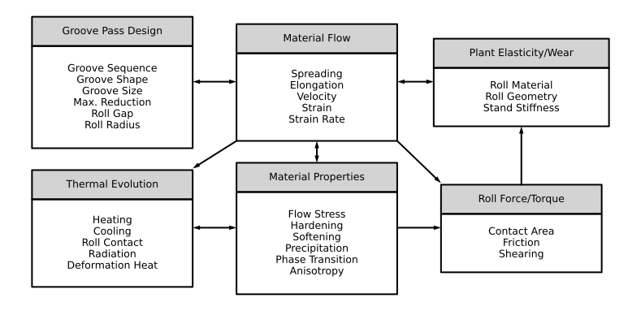

# Home

PyRolL is an OpenSource rolling framework, aimed to provide a fast and extensible base for rolling simulation. The
current focus lies on groove rolling in elongation grooves. The core packages comes with a basic set of models to allow
a first estimation of forces and torques occurring in a pass sequence. There is a flexible plugin system, able to modify
and extend the model set available to describe the process.

# Background and Purpose

To the experience of the authors, the field of metal forming simulation is currently dominated by handcrafted, specialized and monolithic or commercial software tools.
Groove rolling is a class of metal forming processes, where a bar of large cross-section (typically coming from casting or previous rolling processes) is rolled down to smaller cross-sections within a number of passes.
The shape of the cross-section is determined by the shape of the roll surface, milled into the roll barrel, known as the groove or calibre.
The products are commonly known as long products such as wire, bars or rods, because their length is usually much larger than their width and height.
The passes can be directly coupled (multiple stands are grabbing the workpiece at the same time), called a continuous or "conti" rolling line, or, one pass is performed after each other, called reversing rolling, because the direction of rolling is typically reversed to avoid long transports of the workpiece.
There is a large variety of modelling approaches for groove rolling processes published in scientific literature within the last century, but often not available as software implementation to the public.

Groove rolling is a rather complex process, one has to deal with mechanical loads, material flow, heat flow and generation, microstructure evolution and others.
The figure below gives an impression about the influencing factors and their interdependencies.



Some of them are not describable by physically based models, or only with unsuitable high effort in computational resources.
For this reason, there are large amounts of empirical approaches describing the distinct aspects suitable for specific conditions and materials.
These often give sufficient results at low computation cost, if respective material specific coefficients are available and specific conditions of validity are met.
For some aspects, especially those regarding material behavior and evolution, specialized and commonly used software tools already exist.
PyRolL can use them as a subroutine if an appropriate interface plugin is available.

The PyRolL project as a whole aims to provide a flexible software basis and a growing collection of model packages for the distinct aspects of groove rolling.
With this, a rolling engineer can:

- exchange the used models
- choose the ones that fit best to his conditions or those for which he has data available
- examine differences in their predictions
- give a reasonable estimation of mechanical and thermal behavior of the process
- identify possible pit holes and sources of errors
- design a new process or optimize an exising one
- lower energy consumption and production costs.
 
A typical rolling simulation will need the following inputs:

- shape, temperature and material data of the workpiece put in the first pass
- geometry of roll passes
  - groove shapes
  - roll diameter
  - roll gap (distance between roll barrels)
- kinetics of roll passes, usually by means of the rolls' rotational frequencies
- plant geometry, distances between rolling stands
- elastic properties of the rolling stands and rolls, if desired.

Classic values of interest from a rolling simulation include:

- roll forces and torques to determine if the stand withstands the forces and the engines are powerful enough
- filling of the grooves, to:
  - ensure full-filling in the last pass to obtain desired cross-section shape
  - avoid over-filling in the other stands to prevent surface defects
- temperature evolution of the workpiece in conjunction with microstructure evolution to obtain desired material properties.

PyRolL's implementation in Python leverages the full power of Python's scientific community and package toolbox like [numpy](https://numpy.org), [scipy](https://scipy.org), [pandas](https://pandas.pydata.org), [matplotlib](https://matplotlib.org) and [Jupyter](https://jupyter.org) for the analysis and post-processing of the simulation results.
PyRolL must not be understood as a click'n'run tool for generation of colorful images, but as a toolbox for an engineer or scientist, who has basic understanding of rolling theory and materials science, as well as basic skills in programming.

## Installation

The PyRolL Core package is installable via [PyPI](https://pypi.org)

```shell
pip install pyroll-core
```

A collection of extension and plugin packages can be installed the same way, the packages' names usually start
with `pyroll-`.
Use the [PyPI search](https://pypi.org/search/?q=pyroll) or look at the
[extensions list](extensions/index) and [plugins list](plugins/index).

A basic ready-to-use configuration can be installed with

```shell
pip install pyroll-basic
```

Read [here](basic/index) for further information on the basic configuration.

## Where to Get Started

There is a [collection of examples](examples/index.md) to ease the start into the usage of PyRolL.
Especially for absolute beginners, it is recommended to start with the [basic example](examples/pyroll-examples/Basic_Usage_Of_PyRolL.html).

After following the first examples, you shall read the [recommendations](recommendations.md).

To learn about the data structures used to represent the rolling process, read into
the [documentation of the core package](core/index.md), especially the notes about [profiles](core/profiles.md)
and [units](core/units/index.md).

To explore modelling approaches, see in the [plugins list](plugins/index.md). To explore packages aimed at user interface and application, see the [extensions list](extensions/index.md).

If you encounter problems, please refer first to the [troubleshooting page](troubleshooting.md).
If this does not solve your problem, you may contact us via the following ways:

- If you think you have found a bug, please file an issue in the respective GitHub repository (
  e.g. [here for bugs in the core package](https://github.com/pyroll-project/pyroll-core/issues)).
- If your problem is not likely to be a bug, please open a thread on
  the [discussions board](https://github.com/pyroll-project/pyroll-core/discussions). So the answer to your question is
  available to everyone.
- If your problem contains confidential information, you may contact us
  via [email](mailto:kalibrierzentrum@imf.tu-freiberg.de) directly.

In public correspondence, please stick to English language, so everyone can read it. In private correspondence, you may also use German language.

## Contents

```{toctree}
:maxdepth: 2
   
core/index
extensions/index
plugins/index
basic/index
recommendations
setup/index
examples/index
troubleshooting
```

## Trivia

### What is this flappy bird?

The German name of the [Golden Oriole](https://en.wikipedia.org/wiki/Eurasian_golden_oriole) is *Pirol*, which resembles
the name PyRolL.
