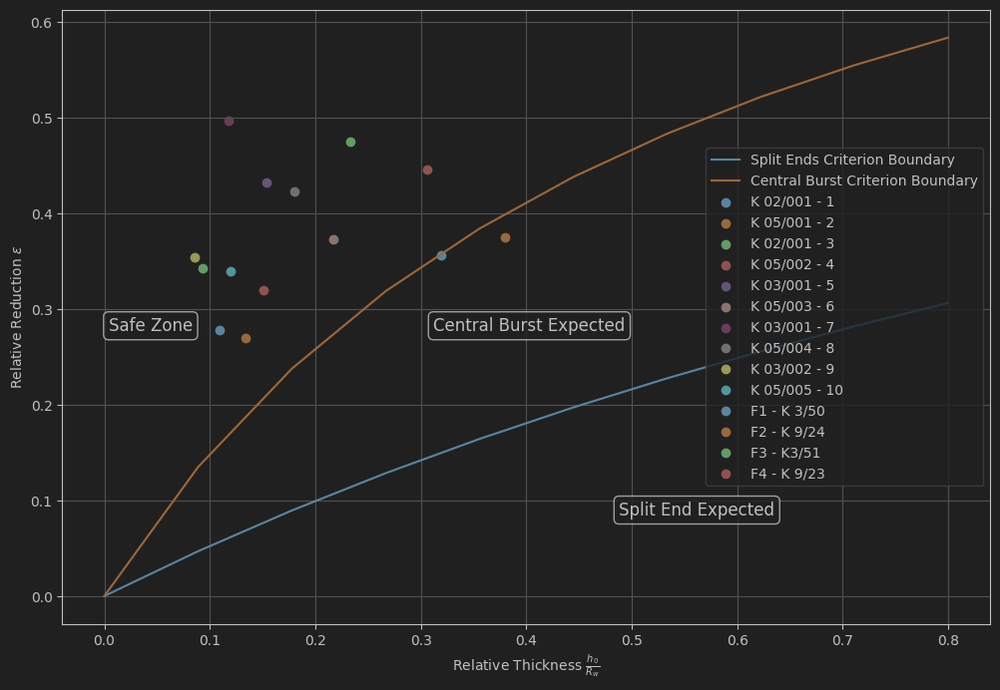

# Split Ends in Rolling of Continuous Cast Billets

## Overview

Split ends (also known as "crocodiling") are critical defects that can occur during flat rolling processes. These defects manifest as cracks forming along the center plane of the deformed material, ranging from slight separation of the upper and lower halves to complete splitting that can damage rolls and mill accessories.
An analysis for this problem can be done using PyRolL, with 

## Defect Types in Rolling

### Split Ends
- **Location**: Cracks at the strip ends along the center plane
- **Visibility**: Externally visible defect
- **Severity**: Can range from minor separation to complete roll encasement
- **Impact**: Yield loss, rolling disturbances, potential equipment damage

### Central Bursts
- **Location**: Internal voids or cracks within the material core
- **Visibility**: Often not visible from outside (internal defect)
- **Mechanism**: Caused by unfavorable stress distributions in the material interior
- **Impact**: Compromises material quality and structural integrity

**Important**: Central bursts are more likely to occur than split ends, but are harder to detect due to their internal nature.

## Mathematical Modeling

Both defects can be analyzed using the **upper-bound method** of limit analysis with rigid body triangular rotational velocity fields for the deformation zone.


### For Perfectly Plastic Materials

**Central Bursts occur when**:
```
h₀/R₀ > 0.57 · ε/(1-ε)
```

**Split Ends occur when**:
```
h₀/R₀ > 1.81 · ε/(1-ε)
```

Where:
- h₀ = initial strip thickness
- R₀ = roll radius
- ε = relative reduction

### Critical Roll-Gap Shape Factor

The dangerous range of rolling parameters begins when the roll-gap shape factor exceeds:
```
Δ = (h₀ + h_f)/(2·l_d) > 0.75 - 0.79
```

Where:
- h_f = final strip thickness
- l_d = projected arc of contact length

## Key Influencing Parameters

Defects are promoted by:

| Parameter | Effect on Defect Formation |
|-----------|---------------------------|
| **Large initial thickness (h₀)** | ↑ Increases risk |
| **Small reduction (ε)** | ↑ Increases risk |
| **Small roll radius (R₀)** | ↑ Increases risk |
| **High shape factor (Δ)** | ↑ Increases risk |
| **External tensions** | ↑ Promotes central bursts (especially back tension) |


## Industrial Relevance

**High-risk operations**:
- Slab rolling
- Heavy gauge plate rolling
- Roughing stands in hot strip mills
- Rolling thick plates with small reductions

**Prevention strategies**:
1. Maintain shape factor Δ < 0.75
2. Avoid small reductions on thick products
3. Use larger roll diameters when possible
4. Control external tensions carefully
5. Monitor material quality (inclusions, discontinuities)

## Conclusions

1. **Central bursts are more probable than split ends** but harder to detect
2. Both defects are **energetically favorable** when the shape factor exceeds ~0.75-0.79
3. **Thick products with small reductions** represent the most dangerous conditions
4. The **upper-bound method provides reliable predictions** for defect occurrence
5. **Strain hardening slightly increases** the risk compared to perfectly plastic materials
6. **External tensions promote central bursts**, with back tension having greater effect than front tension

## References

1. **Turczyn, S.** (1992). "The effect of deformation-zone geometry on split-ends formation in plane-strain rolling." *Steel Research*, 63(2), 69-73.
   - DOI: Not provided in original paper
   - Key contribution: First analytical model for split-ends using upper-bound method with uni-triangular velocity field

2. **Turczyn, S.** (1996). "The effect of the roll-gap shape factor on internal defects in rolling." *Journal of Materials Processing Technology*, 60, 275-282.
   - DOI: 10.1016/0924-0136(96)02342-4
   - Key contribution: Extended model to include central bursts, experimental validation, critical shape factor determination


*Note: This analysis is based on upper-bound limit analysis theory and has been validated experimentally for aluminum alloys and steel. The criteria provide conservative estimates for industrial rolling operations.*
Exemplary, conduction this analysis, we use the IMF - semi continuous roll pass design.

Implementation in PyRolL:

```python
import numpy as np
import pyroll.basic as pr
from pathlib import Path
import matplotlib.cm as cm
import matplotlib.pyplot as plt
```

```python
in_profile = pr.Profile.round(
    diameter=50e-3,
    temperature=1200 + 273.15,
    strain=0,
    material=["C45", "steel"],
    density=7.5e3,
    specific_heat_capacity=690,
    thermal_conductivity=23
)
```

## Implementing the Rolling Train
 
```python
REVERSING_PAUSE_DURATION = 6.1

sequence = pr.PassSequence([
    pr.RollPass(
        label="K 02/001 - 1",
        roll=pr.Roll(
            groove=pr.SwedishOvalGroove(
                r1=6e-3,
                r2=26e-3,
                ground_width=38e-3,
                usable_width=60e-3,
                depth=7.25e-3
            ),
            nominal_radius=321e-3 / 2,
            rotational_frequency=0.99
        ),
        gap=13.5e-3,
        back_tension=0,
        front_tension=0
    ),
    pr.Transport(
        label="I->II",
        duration=REVERSING_PAUSE_DURATION
    ),
    pr.RollPass(
        label="K 05/001 - 2",
        roll=pr.Roll(
            groove=pr.RoundGroove(
                r1=4e-3,
                r2=18e-3,
                depth=17.5e-3
            ),
            nominal_radius=321e-3 / 2,
            rotational_frequency=0.99
        ),
        gap=1.5e-3,
        back_tension=0,
        front_tension=0
    ),
    pr.Transport(
        label="II->III",
        duration=REVERSING_PAUSE_DURATION
    ),
    pr.RollPass(
        label="K 02/001 - 3",
        roll=pr.Roll(
            groove=pr.SwedishOvalGroove(
                r1=6e-3,
                r2=26e-3,
                ground_width=38e-3,
                usable_width=60e-3,
                depth=7.25e-3
            ),
            nominal_radius=321e-3 / 2,
            rotational_frequency=1.98
        ),
        gap=1.5e-3,
        back_tension=0,
        front_tension=0
    ),
    pr.Transport(
        label="III->IV",
        duration=REVERSING_PAUSE_DURATION
    ),
    pr.RollPass(
        label="K 05/002 - 4",
        roll=pr.Roll(
            groove=pr.RoundGroove(
                r1=4e-3,
                r2=13.5e-3,
                depth=12.5e-3
            ),
            nominal_radius=321e-3 / 2,
            rotational_frequency=1.98
        ),
        gap=1e-3,
        back_tension=0,
        front_tension=0
    ),
    pr.Transport(
        label="IV->V",
        duration=REVERSING_PAUSE_DURATION
    ),
    pr.RollPass(
        label="K 03/001 - 5",
        roll=pr.Roll(
            groove=pr.CircularOvalGroove(
                r1=6e-3,
                r2=38e-3,
                depth=4e-3
            ),
            nominal_radius=321e-3 / 2,
            rotational_frequency=1.98
        ),
        gap=5.4e-3,
        back_tension=0,
        front_tension=0
    ),
    pr.Transport(
        label="V->VI",
        duration=REVERSING_PAUSE_DURATION
    ),
    pr.RollPass(
        label="K 05/003 - 6",
        roll=pr.Roll(
            groove=pr.RoundGroove(
                r1=3e-3,
                r2=10e-3,
                depth=9e-3
            ),
            nominal_radius=321e-3 / 2,
            rotational_frequency=1.98
        ),
        gap=1.8e-3,
        back_tension=0,
        front_tension=0
    ),
    pr.Transport(
        label="VI->VII",
        duration=REVERSING_PAUSE_DURATION 
    ),
    pr.RollPass(
        label="K 03/001 - 7",
        roll=pr.Roll(
            groove=pr.CircularOvalGroove(
                r1=6e-3,
                r2=38e-3,
                depth=4e-3
            ),
            nominal_radius=321e-3 / 2,
            rotational_frequency=1.98
        ),
        gap=0.8e-3,
        back_tension=0,
        front_tension=0
    ),
    pr.Transport(
        label="VII->VIII",
        duration=REVERSING_PAUSE_DURATION,
    ),
    pr.RollPass(
        label="K 05/004 - 8",
        roll=pr.Roll(
            groove=pr.RoundGroove(
                r1=2e-3,
                r2=7.5e-3,
                depth=5.5e-3
            ),
            nominal_radius=321e-3 / 2,
            rotational_frequency=1.98
        ),
        gap=3.8e-3,
        back_tension=0,
        front_tension=0
    ),
    pr.Transport(
        label="VIII->IX",
        duration=REVERSING_PAUSE_DURATION  
    ),
    pr.RollPass(
        label="K 03/002 - 9",
        roll=pr.Roll(
            groove=pr.CircularOvalGroove(
                r1=6e-3,
                r2=21.2e-3,
                depth=2.5e-3
            ),
            nominal_radius=321e-3 / 2,
            rotational_frequency=1.98
        ),
        gap=3.5e-3,
        back_tension=0,
        front_tension=0
    ),
    pr.Transport(
        label="IX->X",
        duration=REVERSING_PAUSE_DURATION
    ),
    pr.RollPass(
        label="K 05/005 - 10",
        roll=pr.Roll(
            groove=pr.RoundGroove(
                r1=0.5e-3,
                r2=6e-3,
                depth=4e-3
            ),
            nominal_radius=321e-3 / 2,
            rotational_frequency=1.98
        ),
        gap=4e-3,
        back_tension=0,
        front_tension=0
    ),
    pr.Transport(
        label="->F1",
        duration=REVERSING_PAUSE_DURATION
    ),
    pr.RollPass(
        label="F1 - K 3/50",
        roll=pr.Roll(
            groove=pr.CircularOvalGroove(
                r1=2.5e-3,
                usable_width=15.6e-3,
                depth=(8.1e-3 - 2.3e-3) / 2,
            ),
            nominal_radius=215e-3 / 2,
            rotational_frequency=11.5
        ),
        gap=2.3e-3,
        back_tension=0,
        front_tension=0
    ),
    pr.Transport(
        label="F1->F2",
        duration=1.5 / 7.8
    ),
    pr.RollPass(
        label="F2 - K 9/24",
        roll=pr.Roll(
            groove=pr.RoundGroove(
                r1=0.5e-3,
                r2=5.1e-3,
                depth=(10e-3 - 1.5e-3) / 2
            ),
            nominal_radius=215e-3 / 2,
            rotational_frequency=13.77,   
        ),
        gap=1.5e-3,
        back_tension=0,
        front_tension=0
    ),
    pr.Transport(
        label="F2->F3",
        duration=1.5 / 9.3
    ),
    pr.RollPass(
        label="F3 - K3/51",
        roll=pr.Roll(
            groove=pr.CircularOvalGroove(
                r1=2.5e-3,
                usable_width=12.8e-3,
                depth=(6.2e-3 - 1.96e-3) / 2,
            ),
            nominal_radius=215e-3 / 2,
            rotational_frequency=17.85,
        ),
        gap=1.96e-3,
        back_tension=0,
        front_tension=0
    ),
    pr.Transport(
        label="F3->F4",
        duration=1.5 / 12.06,
        
    ),
    pr.RollPass(
        label="F4 - K 9/23",
        roll=pr.Roll(
            groove=pr.RoundGroove(
                r1=0.5e-3,
                r2=4.1e-3,
                depth=(8e-3 - 1.5e-3) / 2
            ),
            nominal_radius=170e-3 / 2,
            rotational_frequency=29.5,
        ),
        gap=1.5e-3,
        back_tension=0,
        front_tension=0
    )
])
```

Next up we define the functions defined by S. Turczyn used in the analysis.

```python
def turczyn_criteria(roll_pass: pr.RollPass):
    abs_rel_draught = np.abs(roll_pass.rel_draught)
    central_burst_criteria = 0.57 * abs_rel_draught / (1 - abs_rel_draught)
    split_end_criteria = 1.81 * abs_rel_draught / (1 - abs_rel_draught)
    relative_thickness = roll_pass.in_profile.height / roll_pass.roll.working_radius

    central_burst = False
    split_end = False

    if relative_thickness > central_burst_criteria:
        central_burst = True
    if relative_thickness > split_end_criteria:
        split_end = True

    if central_burst is True and split_end is True:
        print(f"{roll_pass.label} shows risk for central bursts and split ends!")
    elif central_burst is True and split_end is False:
        print(f"{roll_pass.label} shows risk for central bursts!")
    elif central_burst is False and split_end is True:
        print(f"{roll_pass.label} shows risk for split ends!")
    else:
        print(f"{roll_pass.label} shows no risk!")
```

Also, we can define the criteria as functions to use for further plotting.
So in the end a graphical analysis, is possible. 

```python
relative_thickness_demo = np.linspace(start=0, stop=0.8, num=10)

def split_ends_function_for_plotting(relative_thickness):
    return relative_thickness / (1.81 + relative_thickness)


def central_burst_function_for_plotting(relative_thickness):
    return relative_thickness / (0.57 + relative_thickness)
```

Using the simple defined functions we can now, analyse the pass sequence.

```python
labels = []
relative_thicknesses = []
relative_reduction = []
for  rp in sequence.roll_passes:
    labels.append(rp.label)
    relative_thicknesses.append(rp.in_profile.height / rp.roll.working_radius)
    relative_reduction.append(np.abs(rp.rel_draught))
    turczyn_criteria(rp)
    return relative_thickness / (0.57 + relative_thickness)
```

Plotting the result reveals, that the pass design is safe when it comes to the risk of split ends. 


```python
fig, ax = plt.subplots(figsize=(12, 8))
ax.grid(True)
ax.plot(
    relative_thickness_demo,
    split_ends_function_for_plotting(relative_thickness_demo),
    label="Split Ends Criterion Boundary",
)
ax.plot(
    relative_thickness_demo,
    central_burst_function_for_plotting(relative_thickness_demo),
    label="Central Burst Criterion Boundary",
)


for i, label in enumerate(labels):
    ax.scatter(relative_thicknesses[i], relative_reduction[i], label=f"{label}")

ax.legend()


ax.text(
    0.05,
    0.5,
    "Safe Zone",
    transform=ax.transAxes,
    fontsize=12,
    verticalalignment="top",
    bbox=dict(boxstyle="round", facecolor="white", alpha=0.8),
)

ax.text(
    0.4,
    0.5,
    "Central Burst Expected",
    transform=ax.transAxes,
    fontsize=12,
    verticalalignment="top",
    bbox=dict(boxstyle="round", facecolor="white", alpha=0.8),
)

ax.text(
    0.6,
    0.2,
    "Split End Expected",
    transform=ax.transAxes,
    fontsize=12,
    verticalalignment="top",
    bbox=dict(boxstyle="round", facecolor="white", alpha=0.8),
)

ax.set_xlabel(r"Relative Thickness $\frac{h_0}{R_{w}}$")
ax.set_ylabel(r"Relative Reduction $\epsilon$")
```

